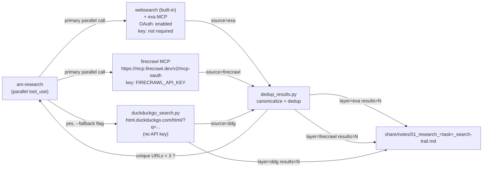

# Book Kit — Architecture

## Two-layer model

| Layer | Lives in | Owned by |
|---|---|---|
| **Engine** | The kit ZIP itself | Kit maintainer (versioned) |
| **Workspace** | The user's project | User (preserved across upgrades) |

The installer writes engine files; the user owns the workspace. The
`manifest.json` records which is which.

## Agent roster (6 agents, no controller)

```
                user
                 |
                 v
            +---------+
            | master  |   book-gen-orchestrator skill
            +---------+   loaded on book intent
                 |
   +------+------+------+------+
   |      |      |      |      |
   v      v      v      v      v
 research plan  design  coder  review
                                       ^
                                       |
                              book-writer skill
                              loaded by coder in book mode
```

- `master` orchestrates ONLY. Never codes, plans, designs, or reviews itself.
- `research`, `planning`, `design`, `coder`, `review` are the standard
  agents_manager specialists, slimmed for book-gen.
- Two skill files are NOT agents — they're loaded on demand:
  - `book-gen-orchestrator` (master loads on book intent)
  - `book-writer` (coder loads when dispatched in book mode)

## What's deliberately NOT in the kit

The kit ships the minimum surface needed for book-gen. The full
agents-manager controller also ships `am-assets`, `am-investigate`,
`am-ship`, `am-health`, plus release pipelines, version bumping, and
controller maintenance. None of that is relevant to writing a book, so it's
not here.

| Controller surface | In Book Kit? | Why |
|---|---|---|
| `am-assets` | no | books have no video asset pipeline |
| `am-investigate` | no | books rarely need root-cause debugging |
| `am-ship` | no | release = user copy-zip action |
| `am-health` | no | "is this healthy?" is a code concept, not a book concept |
| `bin/agents-manager*` | no | controller dispatcher |
| `bin/standalone-installer/` | no | replaced by `install.py` |
| `bin/release-zip*` | no | kit is built locally + uploaded |
| `book_workflow/book-agents/am-*/SKILL.md` | no | superseded by slimmed `agents_manager/<role>/` |
| Git history | no | users want files, not commits |
| OpenCode binary | no | host-level install |
| MCP servers | no | host-level config |
| `chub` binary | no | optional via `--with-chub` |
| Model credentials | no | configured in OpenCode, not the kit |

## File ownership

```
opencode.jsonc               engine-owned  (overwrite on upgrade)
CLAUDE.md                    engine-owned  (overwrite on upgrade)
VERSION                      engine-owned
.gitattributes               engine-owned
install.py                   engine-owned
manifest.json                engine-owned
bin/book-kit                 engine-owned
bin/book-kit.cmd             engine-owned
scripts/doctor.py            engine-owned
scripts/build_manifest.py    engine-owned
scripts/build_zip.py         engine-owned
scripts/smoke_test.py        engine-owned
agents_manager/**/*.md       engine-owned
book_workflow/templates/*.md engine-owned
docs/*.md                    engine-owned
books/                       user-owned  (never touched)
books/<slug>/chapters/*.md   user-owned  (only am-coder writes these in book mode)
books/<slug>/intake.md       user-owned
tasks/                       user-owned
share/notes/                 user-owned  (inter-agent; am-research, am-coder, master)
share/handoffs/              user-owned  (master only)
share/reports/               user-owned  (am-review only)
```

On `--upgrade`: engine files overwritten (with `.bak.<sha>` backups of prior
content). User-owned files preserved verbatim.

On `--uninstall`: all engine files removed. User-owned files preserved.
Backups `.bak.*` preserved in place; remove manually if unwanted.

## 7-phase pipeline (recap)

See `agents_manager/book-gen-orchestrator/SKILL.md` for the canonical phase
spec. Summary:

```
Phase 0 (master)         intake.md            user gate per field
Phase 1 (am-planning)    skeleton.md
Phase 2 (am-research)    research-log.md
Phase 3 (am-planning)    outline.md           user gate
Phase 4 (am-design)      style-guide.md       user gate
Phase 5 (master)         writing-plan.md      user gate
Phase 6 (am-coder)       chapters/ch-NN.md    + bible append + ledger row
Phase 7 (am-review)      3 passes per ch      dev -> line -> copy (whole book)
```

User gates happen at Phases 0, 3, 4, 5. The orchestrator pauses for explicit
confirmation; no auto-advance.

## Why two skill files (orchestrator + writer) instead of one

The orchestrator is loaded by **master** to route work. The writer is loaded
by **am-coder** to change its working lens from code to prose. Both are
needed because the agent that changes is different in each case:

- Master needs the route table (which specialist, in what order, with what
  boundary prompt). Master does not write prose.
- Coder needs the prose posture (read bible, draft chapter, append facts,
  update ledger). Coder does not route.

Loading both into one skill would either pollute master's lens with prose
posture, or pollute coder's lens with route table. Kept separate.

## Versioning

- Kit version is independent of controller version. Start at `0.1.0`.
- Bump on: orchestrator protocol change, new template added, specialist
  slim-down rule change, installer contract change.
- `agents_manager/CHANGELOG.md` in the parent repo records kit releases.

## Cross-platform notes

- All paths in skill docs use forward slashes; the installer converts on
  Windows when needed.
- `.gitattributes` enforces LF on `.md/.json/.yml/.py/.sh` and CRLF on
  `.ps1/.cmd/.bat`. Working tree may show CRLF on Windows due to
  `core.autocrlf=true`; the build script normalizes on ZIP.
- The installer probes `opencode --version` but does not require it (warns
  if missing). The user can lay down files first, install OpenCode later.
- `chub` is opt-in via `--with-chub`. npm is tried first, pip falls back.
  Both may fail silently on locked-down systems — the agent surfaces the
  gap on first use rather than failing the install.

## Multi-source research MCPs (P9)

The kit's research pipeline uses three search backends in parallel,
with a fourth (DuckDuckGo) as a free fallback. The diagram below shows
how `am-research` composes the layers.



**ASCII fallback** (when the renderer does not grok mermaid):

```
   +-----------+    parallel tool_use    +-----------------+
   | am-       | ----------------------> | websearch (Exa) |
   | research  | ----------------------> | firecrawl MCP   |
   +-----+-----+                         +--------+--------+
         |                                        |
         | primary union < 3 unique URLs?         | source-tagged results
         | (+ --fallback flag)                    v
         |                                +-------+--------+
         +------------------------------> | dedup_results.py|
                                          +-------+--------+
                                                  |
                                                  v
                                share/notes/01_research_<task>_search-trail.md
                                                  ^
                                                  | layer=ddg results=N
                                          +-------+--------+
                                          | duckduckgo_search.py |
                                          | (no API key)        |
                                          +--------------------+
```

Layer details:

- **websearch / exa** - dual-wired. The built-in `websearch` permission
  is the casual-search path; the explicit `exa` MCP is the
  semantic-query path. Both go to `https://mcp.exa.ai/mcp` via OAuth;
  no key required.
- **firecrawl** - OAuth MCP at
  `https://mcp.firecrawl.dev/v2/mcp-oauth`. The MCP gateway accepts the
  `FIRECRAWL_API_KEY` from `.env.local` during the OAuth dance; the
  key is NEVER stored in `opencode.json`.
- **duckduckgo_search.py** - thin Python wrapper around
  `https://html.duckduckgo.com/html/?q=...` (server-rendered HTML, no
  JS). Free, no key, ~30 lines. Parses `result__a` and `result__snippet`
  classes via stdlib regexes.
- **dedup_results.py** - canonicalize (lowercase scheme + host, strip
  `utm_*`, normalize trailing slash on non-root paths) then dedup by
  canonical URL keeping the first occurrence.
- **search-trail.md** - one line per layer (`layer=exa|firecrawl|ddg
  results=N query="..."`); the audit record of which layer produced
  which results. Planning agent reads it before locking the plan.

The host MCP config (`~/.config/opencode/opencode.json`) carries both
`exa` and `firecrawl` entries; `.env.local` carries `FIRECRAWL_API_KEY`
(gitignored). See `agents_manager/research/SKILL.md` section
"Multi-source research protocol (P9)" for the agent-side invocation
contract.

## Book knowledge graph (P18)

The kit ships a SQLite-backed knowledge graph at
`book-kit/mcp/book-kg/`. The package contains four files:

- `schema.sql` -- 12 tables + 1 FTS5 virtual table (verbatim from
  plan section P18) plus a `schema_version` table for forward
  migration.
- `indexer.py` -- walks `books/<slug>/` once per writing dispatch,
  extracts chapters, beats, motifs, characters, frozen lines,
  continuity anchors, and cross-references. Re-runs are idempotent
  (hash-based, no duplicates).
- `query.py` -- `trace_path`, `motifs_in_chapter`, `contradicts`,
  `references`, plus an `fts_search` helper for FTS5 lookups.
- `server.py` -- FastMCP wrapper that exposes the four primary
  queries as MCP tools. The DB path is read from the `BOOK_KG_DB`
  env var (default: `.book-kg.db` in the current directory).

The MCP host wires the server as `<name>book-kg</name>` so any
agent with the MCP available can call the four query tools without
boilerplate. The book-gen orchestrator runs the indexer after
Phase 2 and again after each `am-coder` writing dispatch; the
reviewer calls the tools in Phase 7 to validate motif persistence,
frozen-line consistency, and cross-chapter references.

The indexer accepts `chapters/*.md` matching `^ch-\d+\.md$`,
`bible.md` with `## Continuity anchor` / `## Motifs` /
`## Characters` sections (bullet or table form), and
`frozen-lines.json` matching the project schema. FTS5 uses
`unicode61 remove_diacritics 2` for Arabic-aware search.